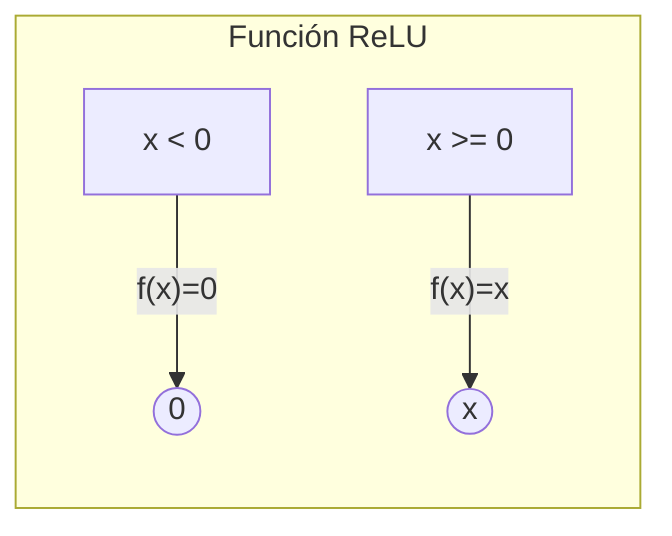

Es una **función de activación** de redes neuronales, es la mas comun debido a su sencillez y eficacia.

Es una *función lineal* por tramos que devuelve el valor de entrada si este es positivo o cero en caso contrario. Convierte los numeros negativos a cero y deja los positivos tal cual los ingresas, lo que ayuda a las redes neuronales a aprender patrones de forma eficiente y rapida.

# Funcionamiento
ReLU es una regla matematica que aplica la siguiente formula:
Matematicamente, ReLU, se define asi:
$$
f(x) = \max(0, x)
$$

Es decir, "Si x > 0 devuelve x, si no devuelve 0"

Esta operacion es computacionalmente barata, pues solo requiere comparar con cero y seleccionar el maximo.

# Analogia de la vida real
Imagina un filtro de agua que solo deja pasar el agua limpia (positiva) y bloquea cualquier particula sucia (negativa).

- El **agua sucia** → queda atrapada (0).
    
- El **agua limpia** → fluye sin cambios (x). 

Asi las redes neuronales descartan los que podria confundir el aprendizaje.

# Por que se usa en IA?
- Evita el problema de gradientes muy pequeños, porque cuando x > 0, la derivdad de ReLU es 1, manteniendo el flujo de aprendizaje.
- Hace la red mas "esparsa", ya que muchos nodos devuelven cero y eso ahorra calculos.
- Entrena mas rapido que sigmoide o tanh, porque no hay exponentes ni divisiones.

# Ejemplos reales de aplicacion 
1. **Visión por computadora**: Redes como AlexNet y ResNet usan ReLU para reconocer objetos en imágenes  .
    
2. **Procesamiento de lenguaje**: Algoritmos de análisis de sentimientos aplican ReLU en sus capas ocultas para entender si un texto es positivo o negativo  .
    
3. **Reconocimiento de voz**: Modelos que transcriben voz a texto usan ReLU para extraer patrones en las señales de audio  .
    
4. **Detección de fraude**: Sistemas financieros basados en redes profundas emplean ReLU para identificar transacciones sospechosas  .

Ahora veamos las ventajas y deventajas
